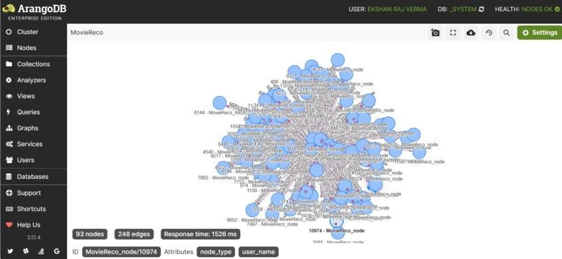

# Graph RAG based movie recommender system
This repository contains a **Graph Retrieval Augmented Generation(GraphRAG) based movie recommender system** that utilizes **ArangoDB** and **NetworkX** to provide personalised movie recommendations
## Prerequisites
- **Python 3.8 or higher** : Ensure that Python is installed on your system
- **Git** : To clone the repository, Git should be installed
## Running the code
1. **Set Up the Graph Database**:
   Ensure that you have a graph database (ArangoDB) installed and running. Populate it with the necessary movie data as specified in the repository
2. **Configure Database Connection**:
   Update the database connection settings in the code to match your local setup. This may include specifying the database URI, authentication credentials, and database name.
3. **Execute the Main Script**:
   Run the main script final.py to start the movie recommender system
## Additional notes
- **Data Preparation**: Ensure that the movie dataset is correctly formatted and imported into the graph database
- **Configuration Files**: Check for any configuration files that may need to be setup before running the code
- **Dependencies**: If you encounter issues with missing packages, please install them manually

## ArangoDB Graph Visualisation

## Movie Recommender UI

